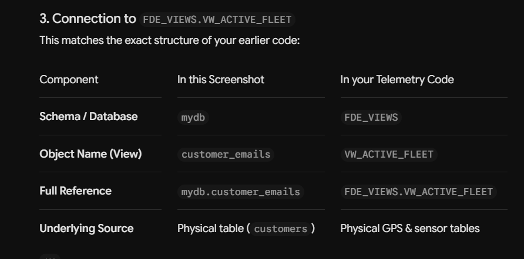
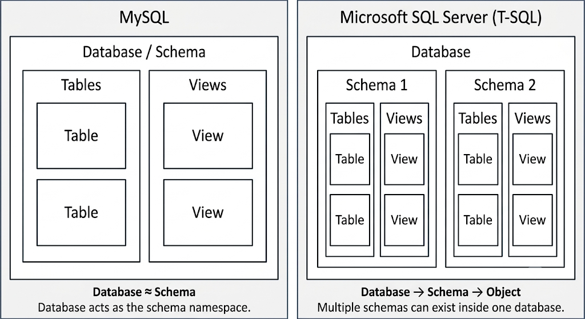

# Cold-Chain-Logistic


info. 

why we need views
In MySQL, Views are virtual tables that provide several key benefits for database management (0:03, 5:43):

Avoid Data Redundancy: Instead of creating a whole new table that duplicates information, a view lets you pull specific columns from existing tables. This prevents you from having to update the same information in multiple places if something changes (0:36-0:55, 5:31).
Always Up-to-Date: Because a view is based on the results of an SQL statement from real tables, any changes, additions, or updates made to those original tables will be automatically reflected in the view without any extra manual work (0:55, 4:23, 5:21).
Simpler Interaction: A view can be queried just like a real table. You can use standard keywords and operators (such as ORDER BY) to interact with the view, making it easier to present or organize specific data sets for your needs (0:11, 1:56, 2:09).


How do I create a new view?
Can I delete a view?
How does a view differ from a table?
but why not use original table
While you could always query the original table, using Views offers significant advantages for database management and security (0:36, 5:31):

Prevents Data Redundancy: If you created a separate table just to hold specific columns (like an attendance sheet), you would have to update it every time an employee is added or removed from the main list. A view updates itself automatically, ensuring you never have to maintain the same information in two places (0:42-0:55, 5:31-5:40).
Simplified Queries: Instead of writing complex JOIN statements or selecting specific columns every single time you need a report, you can save that query as a view. This makes your workflow faster and less prone to errors (1:56-2:11).
Enhanced Security: Views allow you to restrict access. You can provide users with a view that only shows them the information they are authorized to see (e.g., just names, but not salaries), keeping the underlying, sensitive data in the original table hidden (0:52, 5:52).





Fleet telemetry data is the digital information automatically sent from a group of vehicles (the "fleet") to a central computer system while they are driving.
Think of it like a smart fitness watch, but for vehicles. Just like a Fitbit tracks your steps, heart rate, and location, fleet telemetry tracks a vehicle's location, health, and how it is being driven.
The word Telemetry comes from two words: Tele (distance) and Meter (to measure). So, it literally means "measuring things from a distance."
------------------------------
## What is actually inside this data?
Every few seconds, a small hardware device plugged into the vehicle collects and wirelessly transmits a packet of data. That data usually includes:

* 📍 Location (GPS): The exact latitude and longitude coordinates. This tells you where the vehicle is on a map.
* 🚗 Driving Habits: The current speed, how hard the driver brakes, and how fast they accelerate.
* 🔧 Vehicle Health: The engine temperature, battery voltage, oil pressure, and if the "Check Engine" light is on.
* ⛽ Fuel and Mileage: The current fuel level percentage and the total odometer mileage.

------------------------------
## Why do companies care about this data?
If a company owns 500 delivery vans, they cannot sit in the passenger seat of every van. Telemetry data gives them a "birds-eye view" of everything happening on the road so they can:

   1. Track Packages: See exactly how far away a delivery truck is from a customer's house.
   2. Save Money on Fuel: Spot drivers who leave the engine idling (running while parked) for too long, which wastes gas.
   3. Prevent Breakdowns: Get a warning that a truck’s engine is overheating before it actually breaks down on the highway.
   4. Improve Safety: Identify drivers who are speeding or braking aggressively so they can coach them to drive safer.

To help me connect this to what you're working on, tell me:

* Are you working on a software application that needs to show this data?
* Or are you just curious about how modern tracking systems work behind the scenes?


The reason this looks completely different is because of a major difference between **MySQL** (what you see in the screenshot) and **Microsoft SQL Server** (what your fleet script is written for).

---

### In MySQL (The Screenshot)

In MySQL, the word **`SCHEMA`** is literally just another word for **`DATABASE`**:

* In MySQL, `CREATE SCHEMA mydb;` and `CREATE DATABASE mydb;` do the exact same thing.


* **MySQL Workbench creates those folders for you automatically:** When you create any view (like `customer_emails`), Workbench automatically files it into that built-in **`Views`** category drawer in the sidebar. You don't have to create a custom schema for it.


---

### In SQL Server (Your Telemetry Script)

Your script uses `ODBC Driver 18 for SQL Server`, where the database structure works differently:

* A **Database** (e.g., `LogisticsDB`) is the entire container.
* Inside that single database, SQL Server lets you create custom sub-containers called **Schemas** (`dbo`, `FDE_VIEWS`, `HR`, `Finance`).
* By default, everything gets dumped into the **`dbo`** schema.
* To create a brand new sub-container for your AI views, you have to run:
```sql
CREATE SCHEMA FDE_VIEWS;
GO

```


* Once created, your view lives inside that specific sub-container: `FDE_VIEWS.VW_ACTIVE_FLEET`.

---

### Direct Comparison

| Concept | MySQL (Your Screenshot)

 | SQL Server (Your Script) |
| --- | --- | --- |
| **What is a "Schema"?** | The entire database itself (`mydb`).

 | A sub-folder/namespace *inside* a database. |
| **The "Views" Folder** | Automatically provided by Workbench's UI.

 | You create your own schemas (`FDE_VIEWS`) to group objects. |
| **Default Location** | Directly inside `mydb`<br> | Inside the `dbo` schema (e.g., `dbo.my_table`). |
| **Creating a View** | `CREATE VIEW customer_emails AS...`<br> | `CREATE VIEW FDE_VIEWS.VW_ACTIVE_FLEET AS...` |

In MySQL Workbench, you only type `CREATE VIEW` because the software already provides the `Views` organizational folder for you. In SQL Server, `CREATE SCHEMA FDE_VIEWS;` is how you manually build that dedicated, isolated folder inside the database for permissions and security.





Open Database Connectivity (ODBC) is a standard programming interface that allows applications to access and manage data across different database management systems (DBMS) without needing database-specific code.
How ODBC Works
ODBC acts as a universal bridge or translator between an application and a database. Just like a USB port lets you plug in different devices without needing a unique port for each, ODBC lets an app talk to MySQL, SQL Server, Oracle, or other data stores using a single set of commands.
Main Components
• Application: The user-facing program or tool (like Excel or a custom app) that sends SQL requests.
• Driver Manager: The coordinator that loads the correct database driver for the application.
• Driver: The software layer that translates standard ODBC commands into the specific language of a target database.
• Data Source: The actual data storage, including the database, its server, and its network info. Often configured via a Data Source Name (DSN)


This code snippet is responsible for creating a **SQLAlchemy connection engine** to a Microsoft SQL Server database. It uses the `pyodbc` driver library to make the low-level connection and `urllib` to ensure the connection parameters are safely encoded.

Here is a step-by-step breakdown of what each part does:

### 1. Building the Raw Connection String (`conn_str`)

```python
    conn_str = (
        f"DRIVER={{ODBC Driver 18 for SQL Server}};"
        f"SERVER={DB_HOST},{DB_PORT};"
        f"DATABASE={target_database_name};" 
        f"UID={DB_USER};" # Should be the restricted user, e.g., 'USR_FDE_RO'
        f"PWD={DB_PASSWORD};"
        f"Encrypt=no;TrustServerCertificate=yes;"
    )

```

This part uses a Python f-string to construct a standard **ODBC connection string**. This is a series of `KEY=VALUE;` pairs that tell the underlying ODBC driver how to connect to the database.

* **`DRIVER={{ODBC Driver 18 for SQL Server}};`**: Specifies which driver installed on your system to use. In this case, it is Microsoft's ODBC Driver 18. (The double braces `{{ }}` are needed inside an f-string to insert a single brace into the output).
* **`SERVER={DB_HOST},{DB_PORT};`**: The hostname or IP address and the port number of the SQL Server. (Note that SQL Server connection strings use a comma `,` to separate host and port).
* **`DATABASE={target_database_name};`**: The name of the specific database context to connect to. In your setup, this will be your application database (e.g., `LogisticsDB`), which is crucial for safety.
* **`UID={DB_USER};`** and **`PWD={DB_PASSWORD};`**: The username and password for the database login.
* **`Encrypt=no;TrustServerCertificate=yes;`**: These are security settings.
* `Encrypt=no;` means the data transmission isn't encrypted (which you might do in a private development environment).
* `TrustServerCertificate=yes;` means it will connect even if the server's certificate can't be validated against a trusted chain (again, common in dev/test but a security risk in production).


### 2. URL-Encoding the Connection String (`params`)

```python
    params = urllib.parse.quote_plus(conn_str)

```

Connection strings often contain characters that have special meaning within a URL, such as semicolons (`;`), equals signs (`=`), slashes (`/`), and special characters inside a password.

Passing the raw connection string directly as part of a connection URI can cause parsing errors and security vulnerabilities. `urllib.parse.quote_plus()` converts these special characters into a safely encoded, percent-sign format (e.g., `;` becomes `%3B`).

### 3. Creating the SQLAlchemy Engine (`engine`)

```python
    engine = create_engine(f"mssql+pyodbc:///?odbc_connect={params}")

```

This is the final step. It calls SQLAlchemy's `create_engine()` function to build the internal database connection pool and interface.

* **`f"mssql+pyodbc:///?odbc_connect={params}"`**: This constructs a customized SQLAlchemy **Connection URI**.
* **`mssql+pyodbc`**: Tells SQLAlchemy to use the Microsoft SQL Server dialect and connect using the `pyodbc` driver library.
* **`?odbc_connect={params}`**: This is a specific query parameter. By passing the encoded connection string to `odbc_connect`, you are instructing SQLAlchemy/pyodbc to skip its usual automated connection string construction and use the specific parameters you defined in `conn_str`.


### Summary

This method is the standardized, safest, and most robust way to create a SQLAlchemy engine for SQL Server when using the `pyodbc` driver. It separates low-level ODBC parameters from high-level SQLAlchemy dialect configuration, and uses encoding to prevent data corruption or standard SQL injection flaws during the initial connection handshake.


<details><summary>how to connect with --- <summary>
No problem at all! You are right; managing the interplay between Python, operating system ODBC drivers, networking, and SQL security permissions *is* difficult and complex. It is the kind of "plumbing" code that is overwhelming to write manually.

It is absolutely smart to offload this work to an AI next time. The answer is **yes, an AI can handle this entire process.**

Here is exactly what you need to give the AI to get back the correct, secure, and functional code block.

### What Information the AI Needs ("The Inputs")

For an AI to generate the correct code without guessing, you *must* provide these technical details about your target database:

1. **Database Product:** (e.g., Microsoft SQL Server, PostgreSQL, MySQL). *Drivers differ based on the product.*
2. **Target Database Name:** (e.g., `'LogisticsDB'`). *We know from experience not to connect to `'master'`.*
3. **The Specific Goal:** (e.g., "I need a Python tool that allows an AI to strictly run read-only queries against the view `'FDE_VIEWS.VW_ACTIVE_FLEET'`").
4. **Security Constraint (Least Privilege):** Tell the AI, "I am using the restricted, read-only user pattern."
5. **Environment Variable Names:** Tell the AI the names you use to store credentials (e.g., `DB_HOST`, `DB_USER`, `DB_PASSWORD`). **NEVER give the AI your actual passwords.**

---

### Your Prompt Template ("How to Ask")

Copy-paste the prompt below into your next AI session. You just need to fill in the bracketed placeholders `[...]`.

#### Prompt Template to Copy-Paste:

> Create a professional, production-ready Python tool (a function decorated with `@tool`) that connects to a **[1. Microsoft SQL Server]** database using SQLAlchemy and pyodbc.
> It must connect to the **[2. LogisticsDB]** database context (do not use `'master'`). This tool is intended for an LLM agent, so it must be strictly **Read-Only**.
> I have already run the backend security script to create the restricted database user (least privilege). Your code must connect using this restricted user.
> Generate the entire Python code block, adhering to these rules:
> 1. Load the following authentication details from environment variables using `os.getenv()`: **[3. DB_HOST, DB_PORT, DB_NAME, DB_USER, DB_PASSWORD]**. Do not hardcode any credentials.
> 2. Build the connection string explicitly for **[4. ODBC Driver 18 for SQL Server]**. You must URL-encode the connection string using `urllib.parse.quote_plus()` and pass it to SQLAlchemy using the `?odbc_connect=` parameter.
> 3. Use the `with engine.connect() as conn:` statement to manage resources and guarantee the connection is closed.
> 4. The function must accept a single argument: `sql_query: str`.
> 5. Include a basic sanity check in the Python code that validates that the query string starts with `SELECT`.
> 6. Use `cursor.fetchmany(10)` to cap the result set to the first 10 rows, preventing contextual token window overflow or out-of-memory errors.
> 7. The tool must return a single text string containing both the column headers and the fetched rows formatted readably.
> 8. Use a robust `try...except` block to catch any database errors and return them as a safe, friendly text string (e.g., `"Database Error: {e}"`), ensuring the Python program does not crash.
> 
> 

---

### What Will Be Left For You To Do?

After the AI generates the code:

1. Copy the code block into your Python file.
2. Make sure you have run the database security script that creates the restricted user account (like we discussed).
3. Set the matching environment variables (`DB_USER`, `DB_PASSWORD`, `DB_NAME`, `DB_HOST`, `DB_PORT`) in your Python environment.<detail>