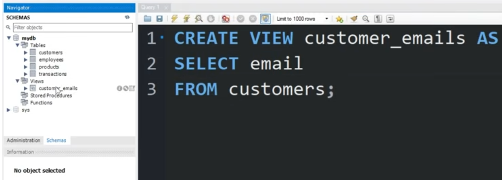
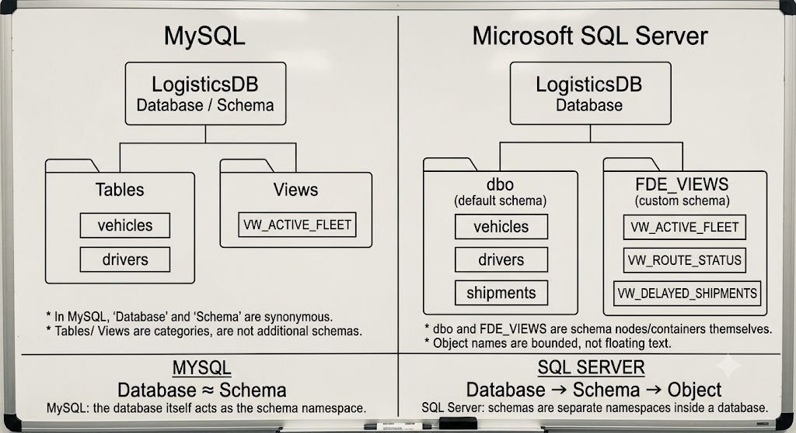

# 🧊 Autonomous Cold-Chain Logistics & Telemetry AI Agent
> **Enterprise Multi-Agent Intelligence System for Real-Time Fleet Telemetry, Corridor Risk Assessment, and SOP Compliance Monitoring.**

---

## 📑 Table of Contents
1. [Project Overview & Architecture](#-project-overview--architecture)
2. [Target Audience: For Whom is this Project?](#-target-audience-for-whom-is-this-project)
3. [What Problem Does It Solve? (Value Proposition)](#-what-problem-does-it-solve-value-proposition)
4. [How It Works: End-to-End Operational Workflow](#-how-it-works-end-to-end-operational-workflow)
5. [Repository File Structure](#-repository-file-structure)
6. [Master Environment Variables Reference (.env)](#-master-environment-variables-reference-env)
7. [Prerequisites & Quick Start Guide](#-prerequisites--quick-start-guide)
8. [End-to-End System Architecture (HLD & LLD)](#-end-to-end-system-architecture-hld--lld)
9. [Core Concepts: Telemetry, Databases & Views](#-core-concepts-telemetry-databases--views)
   - [What is Fleet Telemetry Data?](#what-is-fleet-telemetry-data)
   - [Why Views Are Critical in Enterprise Systems](#why-views-are-critical-in-enterprise-systems)
   - [MySQL vs Microsoft SQL Server (Schemas & Namespaces)](#mysql-vs-microsoft-sql-server-schemas--namespaces)
10. [ODBC, SQLAlchemy & Connection Plumbing](#-odbc-sqlalchemy--connection-plumbing)
   - [How ODBC Works](#how-odbc-works)
   - [Engine Construction & Parameter Encoding](#engine-construction--parameter-encoding)
11. [Step-by-Step Implementation Lifecycle](#-step-by-step-implementation-lifecycle)
   - [Phase 0: Database Provisioning & Legacy Ingestion](#phase-0-database-provisioning--legacy-ingestion)
   - [Phase 1: SOP Document Vectorization (Pinecone)](#phase-1-sop-document-vectorization-pinecone)
   - [Phase 2: Enterprise Security, Semantic Layer & Agent Permissions](#phase-2-enterprise-security-semantic-layer--agent-permissions)
   - [Phase 3: LangGraph Multi-Agent Orchestration](#phase-3-langgraph-multi-agent-orchestration)
   - [Phase 4: Agent Audit Logging Trail](#phase-4-agent-audit-logging-trail)
   - [Phase 5: Interactive Dispatch Console (Streamlit UI)](#phase-5-interactive-dispatch-console-streamlit-ui)
   - [Phase 6: Cloud Deployment on AWS EC2 & Infrastructure Management](#phase-6-cloud-deployment-on-aws-ec2--infrastructure-management)
     - [Local Docker Build & Lifecycle](#local-docker-build--lifecycle)
     - [AWS EC2 Cloud Build & Setup](#aws-ec2-cloud-build--setup)
     - [Container Command Reference (Start, Stop, Restart, Delete)](#container-command-reference-start-stop-restart-delete)
   - [AWS Cost Control & Complete Teardown Guide (Zero-Billing Protocol)](#-aws-cost-control--complete-teardown-guide-zero-billing-protocol)
     - [Pausing (Stopping) vs Destroying (Terminating)](#pausing-stopping-vs-destroying-terminating)
     - [Step-by-Step Complete AWS Deletion Checklist](#step-by-step-complete-aws-deletion-checklist)
12. [Interactive Engineering Q&A & Troubleshooting FAQ](#-interactive-engineering-qa--troubleshooting-faq)
   - [Q1: Where are System vs User Databases coming from in the VS Code Extension?](#q1-where-are-system-vs-user-databases-coming-from-in-the-vs-code-extension)
   - [Q2: Why did the instructor connect to the `master` database initially?](#q2-why-did-the-instructor-connect-to-the-master-database-initially)
   - [Q3: When was `LogisticsDB` created without using the extension?](#q3-when-was-logisticsdb-created-without-using-the-extension)
   - [Q4: Where were `SQL_ADMIN_USER=sa` and `SQL_ADMIN_PASSWORD` created?](#q4-where-were-sql_admin_usersa-and-sql_admin_password-created)
   - [Q5: How to connect and ingest data into AWS EC2 from local machine?](#q5-how-to-connect-and-ingest-data-into-aws-ec2-from-local-machine)
   - [Q6: How to know with 100% certainty if queries hit AWS EC2 or Local Docker?](#q6-how-to-know-with-100-certainty-if-queries-hit-aws-ec2-or-local-docker)
   - [Q7: Why did `uv run scripts\setup_security_and_view.sql` fail with Win32 Error?](#q7-why-did-uv-run-scriptssetup_security_and_viewsql-fail-with-win32-error)
   - [Q8: How to pause EC2 to stop charges and relaunch without container conflicts?](#q8-how-to-pause-ec2-to-stop-charges-and-relaunch-without-container-conflicts)
   - [Q9: Under the hood: How does Python text become a SQL query in `query_telemetry_db`?](#q9-under-the-hood-how-does-python-text-become-a-sql-query-in-query_telemetry_db)
   - [Q10: Why did the `Dispatcher >` prompt freeze on startup in `orchestrator.py`?](#q10-why-did-the-dispatcher--prompt-freeze-on-startup-in-orchestratorpy)
   - [Q11: Why did `CREATE TABLE FDE_VIEWS.AgentAuditLog` throw error "Object already exists"?](#q11-why-did-create-table-fde_viewsagentauditlog-throw-error-object-already-exists)
   - [Q12: Why did Streamlit throw `pyodbc.InterfaceError IM002` (Driver not found)?](#q12-why-did-streamlit-throw-pyodbcinterfaceerror-im002-driver-not-found)
   - [Q13: Why did the first query fail with "Incorrect syntax near 'LIMIT'"? (The Agentic Self-Correction Loop)](#q13-why-did-the-first-query-fail-with-incorrect-syntax-near-limit-the-agentic-self-correction-loop)
13. [AI Prompt Template for Generating Production Database Tools](#-ai-prompt-template-for-generating-production-database-tools)

---

## 🚀 Project Overview & Architecture

Modern pharmaceutical and perishable supply chains rely on unbroken cold chains. Even brief temperature excursions can spoil cargo worth millions of dollars.

This project implements an enterprise-grade multi-agent AI system that:
1. **Monitors Fleet Telemetry**: Queries dynamic IoT sensor logs for refrigerated transport trucks (location, internal cargo temperature, route risk).
2. **Evaluates Environmental Conditions**: Fetches real-time weather and corridor risk via external APIs (Open-Meteo).
3. **Enforces Compliance SOPs**: Semantically searches Standard Operating Procedure (SOP) documentation stored in a Pinecone vector store.
4. **Governs Security & Auditability**: Enforces strict least-privilege database isolation using SQL Server semantic views and persistent immutable audit logs.

---

## 🎯 Target Audience: For Whom is this Project?

This system is built for real-world mission-critical operations where supply chains, data engineering, and AI intersect:

1. **🚚 Front-Line Logistics Dispatchers & Fleet Operators**
   * *Pain Point*: When an alarm triggers on a refrigerated truck at 2:00 AM, dispatchers don't have time to write complex SQL queries or flip through 60-page PDF binders.
   * *Solution*: They ask plain-English questions (*"What is the status of trucks near LA? Is cargo temperature safe?"*) and receive immediate, actionable guidance with exact SOP steps in seconds.

2. **🏢 Logistics Directors & VPs of Supply Chain Operations**
   * *Pain Point*: Millions of dollars lost each year in spoiled perishables, pharmaceutical cargo claims, insurance penalties, and unexpected port bottleneck delays.
   * *Solution*: Real-time fleet visibility, automated delay probability thresholding, and proactive diversion to backup cold-storage facilities before spoilage occurs.

3. **📋 Quality Assurance, HACCP & Compliance Officers**
   * *Pain Point*: Strict regulatory scrutiny from FDA (Food Safety Modernization Act - FSMA), Good Distribution Practice (GDP) for pharmaceuticals, and Hazard Analysis Critical Control Point (HACCP) rules.
   * *Solution*: Automated SOP compliance validation, strict temperature band verification (e.g., 0.0°C–4.0°C for fresh perishables), and automated rule citations for every dispatch decision.

4. **🔐 Enterprise AI, Data & Security Architects**
   * *Pain Point*: Giving LLMs direct access to production databases is a massive security hazard (hallucinations, accidental `DROP TABLE` or `DELETE`, data leakage, and unreadable legacy schemas).
   * *Solution*: A hardened reference architecture combining SQL Server Semantic Views (`FDE_VIEWS.VW_ACTIVE_FLEET`), database least-privilege roles (`USR_FDE_RO`), input query guardrails, and immutable audit trails (`AgentAuditLog`).

---

## ⚡ What Problem Does It Solve? (Value Proposition)

| Pain Point in Traditional Logistics | How This Multi-Agent System Solves It |
| :--- | :--- |
| **Silent Cargo Spoilage & Delayed Reaction**<br>Cargo warms up due to an auxiliary reefer failure, but dispatchers only notice hours later when unloading at the dock. | **Instant Telemetry Anomaly Detection**<br>The agent analyzes live temperatures from IoT sensors and cross-references them against product-specific SOP thresholds in real time. |
| **Information Fragmentation & Cognitive Overload**<br>A dispatcher has to manually check: (1) SQL database for coordinates, (2) weather website for storm/heatwave risks, and (3) a static PDF document for policy rules. | **Unified "Domino Effect" Multi-Agent Reasoning**<br>In a single natural language request, the agent orchestrates SQL queries, live Open-Meteo weather APIs, and Pinecone vector search simultaneously. |
| **Subjective & Inconsistent Human Escalations**<br>Night-shift dispatchers don't know whether to reroute a truck themselves or wake up a senior manager. | **Rule-Based Decision Governance (Tier 1 vs Tier 2)**<br>Enforces explicit SOP rules: Dispatchers handle standard anomalies (Tier 1), but shipments with **High Risk + Delay Prob > 0.65** or **Port Congestion > 7.0** are automatically flagged for Tier 2 Manager Escalation. |
| **AI Database Hallucination & Security Risks**<br>Naive LLMs attempt `UPDATE`/`DELETE`, misunderstand cryptic column names (`V_LAT`, `IOT_TEMP_VAL_C`), or leak sensitive data. | **Semantic Insulation & Least-Privilege Role**<br>The agent connects as `USR_FDE_RO` with access strictly limited to a clean English view (`VW_ACTIVE_FLEET`), while base tables are explicitly `DENY`'d. |
| **Lack of Accountability for Automated Decisions**<br>Regulatory bodies require documented proof of why a shipment was diverted or accepted. | **Enterprise Immutable Audit Logging**<br>Every prompt, tool execution, intermediate payload, and decision is persistently logged to `FDE_VIEWS.AgentAuditLog`. |

### The Operational Bottleneck: The Cost of Manual Friction

In legacy supply chain operations, responding to a cold-chain breach requires high cognitive load and manual multi-tool coordination across fragmented interfaces:

```
[ Stage 01 ] ──▶ [ Stage 02 ] ───────────▶ [ Stage 03 ] ──────────▶ [ Stage 04 ]
Driver Detects   Dispatcher Manually       Searching Complex         Executing Manual
Temp Drift       Queries SQL & Dashboards  PDF SOP Handbooks         Manager Escalation
(Reefer Alarm)   (Latency: 5-15 mins)      (Latency: 10-20 mins)     (High Spoilage Risk)
```

**The AI Assistant Solution**: Compresses this entire 30-minute high-friction sequence into **under 5 seconds** through deterministic multi-tool orchestration.

---

### Dataset & Fleet Telematics Profile

The underlying telemetry engine contains a longitudinal telematics dataset representing full-scale freight operations in the Southern California / Los Angeles logistical corridor:

* **Temporal Coverage**: January 1, 2021 to August 29, 2024 (**~3.7 years of continuous operations**).
* **Sampling Frequency**: Exactly 1 recorded telemetry heartbeat per hour across the active fleet.
* **Volume Distribution**:
  * **2021**: 8,760 records (full calendar year)
  * **2022**: 8,760 records (full calendar year)
  * **2023**: 8,760 records (full calendar year)
  * **2024**: 5,785 records (partial through August 29)
  * **Total Ingested Telemetry**: **32,065 rows**

---

## 🔄 How It Works: End-to-End Operational Workflow

The system operates across a **6-stage pipeline** connecting raw IoT telematics to executive decision support:

```mermaid
sequenceDiagram
    autonumber
    actor Dispatcher as Dispatcher (Console / UI)
    participant Agent as LangGraph Orchestrator (DeepSeek-V4-Flash)
    participant DB as SQL Server (LogisticsDB on EC2/Docker)
    participant Weather as Open-Meteo Weather API
    participant SOP as Pinecone Vector Store (SOP Index)
    participant Audit as AgentAuditLog (Database Audit Trail)

    Dispatcher->>Agent: "Find shipments near LA, check weather, and verify SOP compliance"
    Note over Agent: Evaluates question & constructs execution plan
    
    Agent->>DB: Tool 1: SELECT TOP 5 * FROM FDE_VIEWS.VW_ACTIVE_FLEET WHERE Latitude ~33.8...
    DB-->>Agent: Returns: Lat=33.87, Lon=-118.45, Temp=18.98°C, Risk=High, DelayProb=0.999
    
    Agent->>Weather: Tool 2: GET /forecast?lat=33.87&lon=-118.45
    Weather-->>Agent: Returns: Ambient Temp=37.3°C, Wind=17.7km/h, High Disruption (8.5/10)
    
    Agent->>SOP: Tool 3: Query: "Temperature threshold for fresh perishables and high risk escalation"
    SOP-->>Agent: Returns: Fresh Perishables max 4.0°C; High Risk + Delay > 0.65 = Tier 2 Escalation
    
    Note over Agent: Synthesizes multi-source evidence into structured response
    Agent->>Audit: INSERT INTO FDE_VIEWS.AgentAuditLog (Session, Node, Tool, Payload)
    Agent-->>Dispatcher: Structured Output: Executive Summary + Telemetry Table + SOP Action Plan
```

### Detailed Operational Stages:
1. **IoT Fleet Telemetry Ingestion**: Fleet vehicles stream coordinates, temperatures, delay probabilities, and congestion levels into `dbo.TBL_SC_FLEET_HIST_RAW`.
2. **Semantic View Abstraction**: `FDE_VIEWS.VW_ACTIVE_FLEET` cleans legacy abbreviations (`TS_UTC` $\rightarrow$ `Timestamp`, `IOT_TEMP_VAL_C` $\rightarrow$ `Current_Temperature_C`), eliminating the chance of LLM confusion.
3. **Dispatcher Plain-English Interface**: Users interact via the Streamlit Web Console or CLI without writing a single line of SQL.
4. **LangGraph State Machine Coordination**: The reasoner evaluates the user's intent:
   * Telemetry questions trigger `query_telemetry_db`.
   * Geographic risk triggers `fetch_corridor_conditions`.
   * Policy / rule questions trigger `search_compliance_sop`.
   * Pure conversational queries route directly with no tools (Restraint mechanism).
5. **Structured Decision Matrix**: Responses are strictly formatted into:
   * **1. Executive Summary**: Core anomaly & immediate risk level.
   * **2. Telemetry & Environment Analysis Table**: Joint coordinates, temperatures, and ambient corridor weather.
   * **3. Required Action Plan**: Immediate remediation steps with exact legal SOP citations.
6. **Regulatory Audit Logging**: Every interaction is captured in `FDE_VIEWS.AgentAuditLog` for management inspection.

---

### Incident Governance Matrix: Tier 1 vs Tier 2 Escalation Rules

The system implements clear, rule-based escalation boundaries derived from standard operating protocols:

| Incident Dimension | 🟢 Tier 1: Dispatcher Authority (Handle It) | 🔴 Tier 2: Logistics Manager Escalation (Elevate) |
| :--- | :--- | :--- |
| **Role & Persona** | Front-line dispatcher on active shift. | Senior Logistics Manager / Control Tower Director. |
| **Operational Scope** | Routine monitoring, minor route delays, manageable deviations. | High-value cargo exposure, severe bottleneck diversions. |
| **Temperature Breach** | Temperature drifting outside standard band (e.g., > 4.0°C) with active auxiliary restart underway. | Severe critical breach (> 10°C excursion) or auxiliary unit mechanical failure. |
| **Risk & Delay Trigger** | `Risk_Classification = 'Low'/'Medium'`, or `Delay_Probability <= 0.65`. | **`Risk_Classification = 'High Risk'` AND `Delay_Probability > 0.65`** (Mandatory escalation trigger). |
| **Port Congestion** | Port Congestion Index $\le$ 7.0 (standard queuing). | **Port Congestion Index > 7.0** (Standard routing suspended; divert to Inland Empire Overflow Depot). |
| **Emergency Diversion** | Standard re-routing along pre-approved corridors. | Cold-chain excursion with ETA delay > 1 hour requiring emergency cold-storage facility diversion. |

---

## 📁 Repository File Structure

A clean, modular repository layout separating data pipelines, database security definitions, prompt templates, multi-agent tools, and user presentation interfaces:

```text
Cold-Chain-Logistic/
├── .env                                # Master environment configuration (API keys, DB host/ports, LLM settings)
├── .gitignore                          # Git exclusion rules (virtual environments, caches, secrets)
├── LICENSE                             # Open-source license (MIT)
├── README.md                           # Comprehensive enterprise documentation & operational guide
├── requirements.txt                    # Project Python dependencies
│
├── data/                               # Data storage & assets
│   ├── cache/                          # Ingestion state tracking
│   │   └── ingestion_hash_cache.json   # MD5 checksums of policy files for incremental Pinecone indexing
│   ├── images/                         # Architectural diagrams, schema comparisons & UI flowcharts
│   │   ├── image.png                   # Views concept & abstraction diagram
│   │   ├── image-1.png                 # Database security & view isolation architecture
│   │   ├── image-2.png                 # MySQL Workbench vs SQL Server schema hierarchy comparison
│   │   └── image-3.png                 # Schema namespace structural breakdown
│   ├── policy/                         # Standard Operating Procedure (SOP) documents
│   │   └── Cold_Chain_Incident_SOP_v2.md # Regulatory compliance & incident escalation guidelines
│   ├── raw/                            # Raw telematics dataset
│   │   └── dynamic_supply_chain_logistics_dataset.csv # 32,065 historical fleet telemetry records
│   └── source/                         # Supplemental telemetry source records
│       └── data.txt                    # Reference metadata & sample data points
│
├── docs/                               # Architectural & setup documentation
│   └── instrutions.md                  # Implementation phase notes & workflow guidelines
│
├── Misc/                               # Architecture diagrams, design docs & executive slides
│   └── Materials/                      # Project blueprints & presentations
│       ├── FDE-YT-Project-Business-Presentation.pdf # Executive business & commercial value deck
│       └── Technical Design Document (TDD)_ Cold-Chain Logistics AI-Assistant.pdf # Enterprise TDD blueprint
│
├── scripts/                            # Provisioning, ingestion & security automation scripts
│   ├── ingest_legacy_data.py           # Auto-provisions LogisticsDB & streams 32k CSV rows into TBL_SC_FLEET_HIST_RAW
│   ├── ingest_sop_pinecone.py          # Multi-format parser, MD5 cache, and Pinecone vector store upsert
│   └── setup_security_and_view.sql     # SQL Server script: FDE_VIEWS schema, VW_ACTIVE_FLEET view, USR_FDE_RO role, audit table
│
└── src/                                # Core application source code
    ├── prompts/                        # LLM prompt engineering templates
    │   └── system_prompt.txt           # Tri-part system prompt (Summary, Analysis Table, Action Plan, T-SQL rules)
    ├── agent_tools.py                  # LangChain @tool definitions (SQL query, Open-Meteo weather, Pinecone SOP search)
    ├── orchestrator.py                 # LangGraph ReAct agent state machine & CLI interactive dispatcher
    └── ui.py                           # Full-featured Streamlit dispatcher web console with live telemetry & audit logs
```

---

## 🔑 Master Environment Variables Reference (.env)

The system relies on a centralized `.env` file at the workspace root to govern authentication, database connectivity, vector index parameters, and model orchestration.

| Variable Name | Required | Default / Example Value | Description |
| :--- | :---: | :--- | :--- |
| `PINECONE_API_KEY` | **Yes** | `pcsk_...` | API Key for Pinecone vector database hosting the SOP compliance index. |
| `SQL_ADMIN_USER` | **Yes** | `sa` | Master System Administrator login for Microsoft SQL Server. Used during initial provisioning, legacy data ingestion, and security setup. |
| `SQL_ADMIN_PASSWORD` | **Yes** | `FdeEnterprisePass123!` | Strong password for the `sa` SQL Server account. Defined during `docker run`. |
| `SQL_AGENT_USER` | **Yes** | `USR_FDE_RO` | Hardened, least-privilege database user used exclusively by the AI agent. |
| `SQL_AGENT_PASSWORD` | **Yes** | `AgentPassword2026!` | Password for the restricted `USR_FDE_RO` account. |
| `SQL_SERVER_HOST` | **Yes** | `localhost` or `98.92.145.137` | Target IP address or hostname for Microsoft SQL Server. Toggle between Local Docker (`localhost`) and AWS EC2 (e.g. `98.92.145.137`). |
| `SQL_SERVER_PORT` | **Yes** | `1433` | Standard Tabular Data Stream (TDS) port for Microsoft SQL Server. |
| `DB_NAME` | **Yes** | `LogisticsDB` | Dedicated database instance storing fleet telemetry and semantic views. |
| `BASE_URL` | **Yes** | `https://api.aicredits.in/v1` | OpenAI-compatible endpoint URL for LLM and embedding API requests. |
| `API_KEY` | **Yes** | `sk-live-...` | Authentication bearer token for LLM and embedding API calls. |
| `Embeddings_model` | **Yes** | `OPENAI` or `LOCAL` | Vector embedding backend selection: `OPENAI` (cloud API) or `LOCAL` (local Hugging Face embeddings). |
| `Local_Embedding_Model` | No | `BAAI/bge-m3` | Hugging Face model identifier when running local embeddings (1024-dim, multi-lingual). |
| `Agent_llm` | **Yes** | `DEEPSEEK` | LLM reasoning engine choice: `DEEPSEEK` (DeepSeek-V4-Flash), `OPENAI` (GPT-4o), or `OLLAMA` (local LLM). |

> [!TIP]
> **Switching Environments Seamlessly**: To switch between Local Docker and AWS EC2 Cloud, you only need to change a single line in `.env`:
> * **Local Docker**: `SQL_SERVER_HOST=localhost`
> * **AWS EC2 Cloud**: `SQL_SERVER_HOST=98.92.145.137` (replace with your active EC2 Public IPv4)

---

## 🏁 Prerequisites & Quick Start Guide

Follow this guide to get the Cold-Chain AI Dispatcher up and running in under 5 minutes.

### 1. System Prerequisites
* **Operating System**: Windows 10/11, macOS, or Linux (Ubuntu 22.04 LTS recommended).
* **Python**: Python 3.10, 3.11, or 3.12 installed.
* **Package Manager**: [`uv`](https://github.com/astral-sh/uv) (recommended for 10x faster package resolution) or standard `pip`.
* **Container Runtime**: [Docker Desktop](https://www.docker.com/products/docker-desktop/) (Windows/macOS) or Docker Engine (Linux).
* **ODBC Driver**: Microsoft ODBC Driver 17/18 for SQL Server (Windows native `SQL Server` driver is also supported via our dynamic fallback).

### 2. Installation & Environment Setup

```bash
# 1. Clone the repository
git clone https://github.com/Shivanshvyas1729/Cold-Chain-Logistic.git
cd Cold-Chain-Logistic

# 2. Create and activate a virtual environment
# Using uv (fastest):
uv venv
.venv\Scripts\activate      # On Windows
# source .venv/bin/activate # On Linux/macOS

# 3. Install project dependencies
uv pip install -r requirements.txt
# Or using pip: pip install -r requirements.txt

# 4. Configure your environment variables
# Copy or create your .env file in the project root:
cp .env.example .env        # Or edit .env directly with your credentials
```

### 3. Database Boot & Data Pipeline

```bash
# Step A: Start Microsoft SQL Server 2022 in Docker
docker run -v mssql_data:/var/opt/mssql \
  -e "ACCEPT_EULA=Y" \
  -e "MSSQL_SA_PASSWORD=FdeEnterprisePass123!" \
  -p 1433:1433 \
  --name legacy-mssql \
  --restart unless-stopped \
  -d mcr.microsoft.com/mssql/server:2022-latest

# Step B: Auto-provision LogisticsDB and stream 32,065 telemetry records
uv run python scripts/ingest_legacy_data.py

# Step C: Deploy Semantic Views, Security Isolation & Audit Tables
# Run scripts/setup_security_and_view.sql in VS Code SQL Server extension
# or execute directly against localhost:1433 using sqlcmd / python.

# Step D: Ingest SOP Compliance Documents into Pinecone Vector Store
uv run python scripts/ingest_sop_pinecone.py
```

### 4. Running the AI Dispatcher

Choose between the interactive Command-Line Interface or the Web Console:

* **Option A: Interactive CLI Console**:
  ```bash
  uv run python src/orchestrator.py
  ```
  Type queries such as: *"Find active shipments near Los Angeles with high risk and verify SOP temperature guidelines."*

* **Option B: Streamlit Dispatch Web UI (Recommended)**:
  ```bash
  uv run streamlit run src/ui.py
  ```
  Open your browser to `http://localhost:8501` to view live fleet metrics, interactive chat with tool inspection accordions, and the immutable regulatory audit trail.

---

## 🏗 End-to-End System Architecture (HLD & LLD)

As specified in the **Technical Design Document (TDD)**, the system relies on a strictly decoupled three-tier enterprise design:

1. **Presentation Tier (Stateless UI)**: Streamlit web console managing user interface sessions only; all heavy reasoning is offloaded to the orchestration tier.
2. **Orchestration Tier (The Brain)**: A LangGraph ReAct agent managing execution lifecycles, intent deconstruction, multi-step tool selection, and synthesis of tool outputs.
3. **Data & Integration Tier (Decoupled & Hardened)**: Strictly isolates the LLM/Agent from raw physical tables using SQL Server semantic views, read-only RBAC wrappers, and Pinecone vector embeddings.

### Agent Resiliency & Fallback Protocols
* **Graceful Degradation**: If external API calls (e.g., Open-Meteo weather) fail due to network timeouts, the agent explicitly reports missing/stale telemetry rather than hallucinating weather conditions.
* **Self-Correction & Query Iteration**: If a SQL query returns a syntax or execution error, the agent logs the error internally, inspects the failure reason, and attempts a simplified query iteration before escalating to a human operator.

### Production Network Perimeter Security (AWS VPC Topology)

In production deployments, the system adheres to strict VPC network isolation:

```
┌────────────────────────────────────────────────────────────────────────┐
│                        AWS Cloud (VPC 10.0.0.0/16)                     │
│                                                                        │
│   ┌────────────────────────────────────────────────────────────────┐   │
│   │  Public Subnet (10.0.1.0/24)                                   │   │
│   │                                                                │   │
│   │    [ App Server Node (EC2) ] ◀── Ingress: Port 8501 (Public)   │   │
│   │    * Streamlit UI Console                                      │   │
│   │    * LangGraph Orchestrator                                    │   │
│   └───────────────────────┬────────────────────────────────────────┘   │
│                           │ Internal TCP Port 1433                     │
│                           │ (Private Subnet IP Only)                   │
│   ┌───────────────────────▼────────────────────────────────────────┐   │
│   │  Private Subnet (10.0.2.0/24)                                  │   │
│   │                                                                │   │
│   │    [ Database Server Node (EC2 / Docker) ]                     │   │
│   │    * Microsoft SQL Server 2022                                 │   │
│   │    * Fully isolated - 0.0.0.0/0 Ingress BLOCKED                │   │
│   │    * Inaccessible from the public Internet                     │   │
│   └────────────────────────────────────────────────────────────────┘   │
└────────────────────────────────────────────────────────────────────────┘
```
1. **Ingress (Public)**: Only Port 8501 (Streamlit App Node) is accessible to authenticated dispatchers over HTTPS.
2. **Internal Communication**: Port 1433 (SQL Server) is locked down via AWS Security Group rules to accept traffic strictly from the private IP of the App Node. The database remains completely invisible to the public internet.

```mermaid
flowchart TB
    subgraph CLIENT["Client Applications & Consoles"]
        UI["Streamlit Dispatch Console\n(src/ui.py)"]
        CLI["CLI Interactive Dispatcher\n(src/orchestrator.py)"]
        EXT["VS Code SQL Server Extension\n(mssql)"]
    end

    subgraph BRAIN["LangGraph Orchestration Layer"]
        AGENT["FDE ReAct Agent\n(DeepSeek-V4-Flash / GPT-4o)"]
        MEM[("MemorySaver Checkpointer\n(Thread State)")]
        PROMPT["Structured System Prompt\n(Executive Summary, Table, Actions)"]
    end

    subgraph TOOLS["Tool Registry (src/agent_tools.py)"]
        T1["Tool 1: query_telemetry_db\n(SQLAlchemy + pyodbc/pymssql)"]
        T2["Tool 2: fetch_corridor_conditions\n(Open-Meteo Live API)"]
        T3["Tool 3: search_compliance_sop\n(Pinecone Vector Retriever)"]
    end

    subgraph CLOUD["AWS EC2 / Local Docker Infrastructure"]
        subgraph DOCKER["Docker Engine (Port 1433:1433)"]
            subgraph SQL_ENGINE["Microsoft SQL Server 2022 Engine"]
                subgraph DB_LOGISTICS["LogisticsDB"]
                    RAW[("dbo.TBL_SC_FLEET_HIST_RAW\n(32,065 Raw Telemetry Records)")]
                    VIEW["FDE_VIEWS.VW_ACTIVE_FLEET\n(Semantic Read-Only View)"]
                    AUDIT[("FDE_VIEWS.AgentAuditLog\n(Execution Trace Trail)")]
                end
                subgraph SYS_DBS["System Databases"]
                    MASTER["master | model | msdb | tempdb"]
                end
                subgraph SEC["Security & Access Gate"]
                    ADMIN_USER["sa (System Administrator)"]
                    AGENT_USER["USR_FDE_RO (Restricted Least-Privilege)"]
                end
            end
        end
        PINECONE[("Pinecone Vector Store\n(sop-index-openai)")]
        METEO["Open-Meteo REST API\n(Live Temp & Wind)"]
    end

    CLIENT --> BRAIN
    AGENT <--> MEM
    PROMPT --> AGENT
    AGENT --> T1
    AGENT --> T2
    AGENT --> T3

    T1 -->|USR_FDE_RO (SELECT only)| VIEW
    VIEW -.->|Translates Legacy Columns| RAW
    T2 --> METEO
    T3 --> PINECONE
    UI -->|USR_FDE_RO (INSERT)| AUDIT
    UI -->|sa (Audit Inspection)| AUDIT
    EXT -->|sa / USR_FDE_RO| SQL_ENGINE

    style VIEW fill:#1565C0,stroke:#64B5F6,stroke-width:2px,color:#fff
    style AGENT fill:#4A148C,stroke:#BA68C8,stroke-width:2px,color:#fff
    style T1 fill:#1B5E20,stroke:#81C784,stroke-width:2px,color:#fff
    style T2 fill:#E65100,stroke:#FFB74D,stroke-width:2px,color:#fff
    style T3 fill:#006064,stroke:#4DD0E1,stroke-width:2px,color:#fff
```

---

## 📊 Core Concepts: Telemetry, Databases & Views

### What is Fleet Telemetry Data?
Fleet telemetry is real-time digital intelligence automatically broadcasted from vehicles on the road to centralized headquarters.

```
       [ Refrigerated Truck ]
   ┌──────────────────────────────┐
   │  GPS: 33.87, -118.45         │  ===> Wireless Cellular / IoT Packets ===>  [ Ingestion Pipeline ]
   │  IoT Temp: 18.98°C (Critical)│                                                    │
   │  Cargo: Fresh Perishables    │                                                    ▼
   │  Delay Prob: 0.999           │                                           [ TBL_SC_FLEET_HIST_RAW ]
   └──────────────────────────────┘
```

Every few seconds, onboard IoT telematics modules record:
* 📍 **Location (GPS)**: Exact latitude and longitude coordinates.
* 🚗 **Driving Dynamics**: Speed, hard braking events, route progress.
* 🔧 **Asset Diagnostics**: Engine status, battery voltage, auxiliary refrigeration unit health.
* 🌡️ **Reefer Sensor Readings**: Internal container temperatures.

### Why Views Are Critical in Enterprise Systems
A **View** is a virtual table defined by an underlying query. In AI and LLM workflows, views provide crucial architectural advantages:
1. **Data Redundancy Prevention**: Views do not duplicate data on disk. When the base table updates, the view reflects changes immediately.
2. **Semantic Translation**: Raw legacy systems often use cryptic column names (e.g., `IOT_TEMP_VAL_C`, `V_LAT`, `CGO_COND_CD`). A view renames these to clean English (`Current_Temperature_C`, `Latitude`, `Cargo_Condition_Code`), drastically reducing LLM hallucinations.
3. **Hardened Security & Isolation**: By granting permissions strictly to the view (`GRANT SELECT ON FDE_VIEWS.VW_ACTIVE_FLEET TO USR_FDE_RO`) while denying table access (`DENY SELECT ON dbo.TBL_SC_FLEET_HIST_RAW`), AI models can never delete, update, or inspect sensitive raw records.




### MySQL vs Microsoft SQL Server (Schemas & Namespaces)

A frequent point of confusion is how MySQL and Microsoft SQL Server handle organizational layers:

| Concept | MySQL | Microsoft SQL Server (Used in this Project) |
| :--- | :--- | :--- |
| **What is a "Schema"?** | Synonymous with an entire **Database** (`CREATE SCHEMA mydb;` = `CREATE DATABASE mydb;`). | A discrete **Namespace/Sub-container** *inside* a database (`LogisticsDB.FDE_VIEWS`). |
| **The "Views" Folder** | Automatically provided by MySQL Workbench sidebar. | Explicitly created via `CREATE SCHEMA FDE_VIEWS;` inside the target database. |
| **Default Location** | Directly inside `mydb`. | Inside the `dbo` schema (e.g., `dbo.TBL_SC_FLEET_HIST_RAW`). |
| **Creation Syntax** | `CREATE VIEW customer_emails AS...` | `CREATE VIEW FDE_VIEWS.VW_ACTIVE_FLEET AS...` |




---

## 🔌 ODBC, SQLAlchemy & Connection Plumbing

### How ODBC Works
Open Database Connectivity (ODBC) is the universal driver standard that bridges client software with relational database management systems:

```
┌─────────────────────────────────┐
│     Python Client Application   │
│   (SQLAlchemy / pyodbc / UI)   │
└────────────────┬────────────────┘
                 │
                 ▼
┌─────────────────────────────────┐
│       ODBC Driver Manager       │
│      (Windows / Linux odbc)     │
└────────────────┬────────────────┘
                 │
                 ▼
┌─────────────────────────────────┐
│  Driver: ODBC Driver 18 / 17    │
│  or Built-in "SQL Server"       │
└────────────────┬────────────────┘
                 │ TCP Port 1433 (TDS Protocol)
                 ▼
┌─────────────────────────────────┐
│   Microsoft SQL Server 2022     │
│   (Docker Container on Host/EC2)│
└─────────────────────────────────┘
```

### Engine Construction & Parameter Encoding

Building a production-ready SQLAlchemy connection requires escaping special characters and passing parameters cleanly:

```python
import urllib.parse
from sqlalchemy import create_engine

# 1. Build low-level ODBC connection string
conn_str = (
    f"DRIVER={{{selected_driver}}};"
    f"SERVER={db_host},{db_port};"
    f"DATABASE={db_name};"
    f"UID={db_user};"
    f"PWD={db_password};"
    f"TrustServerCertificate=yes;"
)

# 2. URL-encode parameters to prevent delimiter corruption
params = urllib.parse.quote_plus(conn_str)

# 3. Initialize SQLAlchemy engine pool
engine = create_engine(f"mssql+pyodbc:///?odbc_connect={params}")
```

* **`urllib.parse.quote_plus`**: Translates semicolons (`;`), equals signs (`=`), and special characters inside passwords into safe percent-encoded format (`%3B`, `%3D`).
* **`TrustServerCertificate=yes`**: Necessary for Docker containers using self-signed TLS certificates to avoid handshake failures.

---

## ⚙️ Step-by-Step Implementation Lifecycle

### Phase 0: Database Provisioning & Legacy Ingestion

#### 1. Downloading & Launching Microsoft SQL Server in Docker
Pull the official Microsoft SQL Server 2022 Linux image and spin up the container with persistent storage:

```bash
# 1. Pull the official Microsoft SQL Server 2022 container image
docker pull mcr.microsoft.com/mssql/server:2022-latest

# 2. Launch container with volume mapping and port exposure
docker run -v mssql_data:/var/opt/mssql \
  -e "ACCEPT_EULA=Y" \
  -e "MSSQL_SA_PASSWORD=FdeEnterprisePass123!" \
  -p 1433:1433 \
  --name legacy-mssql \
  --restart unless-stopped \
  -d mcr.microsoft.com/mssql/server:2022-latest
```
* **Image**: `mcr.microsoft.com/mssql/server:2022-latest` (Enterprise SQL engine running on Ubuntu internally).
* **`-v mssql_data:/var/opt/mssql`**: Maps a named Docker volume to the database data directory, preventing data loss on reboot.
* **`-p 1433:1433`**: Forwards standard TDS port 1433 from host to container.

#### 2. Transforming & Ingesting Legacy Telemetry (`ingest_legacy_data.py`)
Run the data pipeline to transform and ingest the raw dataset:

```powershell
uv run python scripts/ingest_legacy_data.py
```

##### How Ingestion Works Under the Hood:
1. **Database Auto-Provisioning**: Connects to the default `master` database as `sa`, checks `sys.databases`, and runs `CREATE DATABASE [LogisticsDB]` if not present.
2. **Schema Mapping**: Reads `data/raw/dynamic_supply_chain_logistics_dataset.csv` and renames raw clean headers to cryptic legacy enterprise database columns:
   | Clean CSV Header | Legacy Database Column (`dbo.TBL_SC_FLEET_HIST_RAW`) | Meaning |
   | :--- | :--- | :--- |
   | `timestamp` | `TS_UTC` | UTC Timestamp of telemetry heartbeat |
   | `vehicle_gps_latitude` | `V_LAT` | Vehicle GPS Latitude |
   | `vehicle_gps_longitude` | `V_LON` | Vehicle GPS Longitude |
   | `iot_temperature` | `IOT_TEMP_VAL_C` | Cargo temperature recorded by sensor (°C) |
   | `cargo_condition_status` | `CGO_COND_CD` | Cargo condition flag (e.g., Optimal, Warning) |
   | `risk_classification` | `RISK_CLS_TXT` | Risk rating (Low, Medium, High) |
   | `delay_probability` | `DELAY_PROB_DEC` | Probability of shipment delay (0.0 to 1.0) |
   | `port_congestion_level` | `PRT_CNG_LVL` | Congestion rating at destination/origin port |
   | `route_risk_level` | `RT_RSK_IDX` | Route hazard / weather risk index |
3. **Chunked Database Streaming**: Streams all **32,065 rows** in batches of `chunksize=2000` via SQLAlchemy directly into table `dbo.TBL_SC_FLEET_HIST_RAW`.

---

### Phase 1: SOP Document Vectorization (Pinecone)

The Pinecone ingestion pipeline ([`scripts/ingest_sop_pinecone.py`](file:///c:/Users/DELL/Desktop/Cold%20Chain%20Logistic/scripts/ingest_sop_pinecone.py)) is an enterprise-grade document vectorization system equipped with polymorphic file parsing, incremental hash caching, vector index self-healing, and dual embedding model backends.

```powershell
uv run python scripts/ingest_sop_pinecone.py
```

#### Key Architecture & Engineering Features of the Vector Pipeline:

1. **Polymorphic Multi-Format Document Parsing**:
   * **Markdown (`.md`)**: Processed using `MarkdownHeaderTextSplitter` by header hierarchy (`# Header_1`, `## Header_2`, `### Header_3`) so sections (e.g. *Section 3.1: Mandatory Escalations*) retain context before being passed to `RecursiveCharacterTextSplitter(chunk_size=600, chunk_overlap=60)`.
   * **Portable Document Format (`.pdf`)**: Extracted page-by-page via `pypdf`, preserving `{"page_number": N}` metadata for precise regulatory citation.
   * **Plain Text (`.txt`)**: Direct recursive character chunking with cohesive sentence boundaries.
   * **Tabular Spreadsheets (`.csv`, `.xlsx`)**: Serializes every row into semantic key-value strings (`"Column1: Value1 | Column2: Value2"`) with row index tracking, allowing the vector retriever to query tabular rules naturally.

2. **Incremental MD5 Hash Caching (`data/cache/ingestion_hash_cache.json`)**:
   * Prior to processing, an MD5 checksum of every document file in `data/policy/` is calculated and compared against `data/cache/ingestion_hash_cache.json`.
   * If a document has not changed, it is **skipped entirely**, saving embedding API costs and eliminating redundant index writes.

3. **Orphan Vector Pruning (State Synchronization)**:
   * If a document is deleted from `data/policy/`, the pipeline detects the orphaned vectors and purges them from the Pinecone index (via metadata filter delete or deterministic chunk ID prefix matching `doc_name-chunk-*`), ensuring stale SOP guidelines never influence agent decisions.

4. **Dual Embedding Model Architecture & Dimension Self-Healing**:
   * Toggle between Cloud and Local backends using `Embeddings_model` in `.env`:
     * **Cloud OpenAI Mode (`Embeddings_model=OPENAI`)**: Uses `text-embedding-3-small` producing **1536-dimensional** vectors indexed into `sop-index-openai`.
     * **Local HuggingFace Mode (`Embeddings_model=LOCAL`)**: Loads `BAAI/bge-m3` running locally on CPU/GPU producing **1024-dimensional** vectors indexed into `sop-index-local`.
   * **Self-Healing Dimension Check**: If an existing Pinecone index is detected with an incompatible dimension (e.g. switching between 1024-dim and 1536-dim), the pipeline automatically deletes and reprovisions the index with the correct dimensionality and cosine metric (`metric="cosine"`, `ServerlessSpec(cloud="aws", region="us-east-1")`).

---

### Phase 2: Enterprise Security, Semantic Layer & Agent Permissions

AI agents should never have raw administrator privileges or direct access to modify base tables. Execute [`scripts/setup_security_and_view.sql`](file:///c:/Users/DELL/Desktop/Cold%20Chain%20Logistic/scripts/setup_security_and_view.sql) in SQL Server to configure the hardened security layer:

#### Detailed Breakdown of Security Operations:

1. **Create Isolated Schema**:
   ```sql
   USE LogisticsDB;
   GO
   IF NOT EXISTS (SELECT * FROM sys.schemas WHERE name = 'FDE_VIEWS')
   BEGIN
       EXEC('CREATE SCHEMA FDE_VIEWS');
   END
   GO
   ```

2. **Define Sanitized Semantic View (`FDE_VIEWS.VW_ACTIVE_FLEET`)**:
   Translates legacy column names back into clean English for the AI agent:
   ```sql
   CREATE OR ALTER VIEW FDE_VIEWS.VW_ACTIVE_FLEET AS
   SELECT 
       TS_UTC AS [Timestamp],
       V_LAT AS [Latitude],
       V_LON AS [Longitude],
       CAST(IOT_TEMP_VAL_C AS FLOAT) AS [Current_Temperature_C],
       CGO_COND_CD AS [Cargo_Condition_Code],
       RISK_CLS_TXT AS [Risk_Classification],
       DELAY_PROB_DEC AS [Delay_Probability],
       PRT_CNG_LVL AS [Port_Congestion_Level],
       RT_RSK_IDX AS [Route_Risk_Index]
   FROM dbo.TBL_SC_FLEET_HIST_RAW;
   GO
   ```

3. **Provision Restricted Server Login & Database User (`USR_FDE_RO`)**:
   ```sql
   -- Create server-level login if not existing
   IF NOT EXISTS (SELECT * FROM sys.server_principals WHERE name = 'USR_FDE_RO')
   BEGIN
       CREATE LOGIN USR_FDE_RO WITH PASSWORD = 'AgentPassword2026!';
   END
   GO

   -- Map login as a user inside LogisticsDB
   IF NOT EXISTS (SELECT * FROM sys.database_principals WHERE name = 'USR_FDE_RO')
   BEGIN
       CREATE USER USR_FDE_RO FOR LOGIN USR_FDE_RO;
   END
   GO
   ```

4. **Enforce Least-Privilege Role Permissions (GRANT / DENY)**:
   ```sql
   -- 1. Grant SELECT on the sanitized view
   GRANT SELECT ON FDE_VIEWS.VW_ACTIVE_FLEET TO USR_FDE_RO;

   -- 2. Explicitly DENY SELECT on the raw legacy table
   DENY SELECT ON dbo.TBL_SC_FLEET_HIST_RAW TO USR_FDE_RO;

   -- 3. Explicitly DENY all data mutation or schema tampering on the dbo schema
   DENY INSERT, UPDATE, DELETE, ALTER ON SCHEMA::dbo TO USR_FDE_RO;
   GO
   ```

5. **Provision Immutable Audit Log Table with Append-Only Access**:
   ```sql
   IF NOT EXISTS (SELECT * FROM sys.tables t JOIN sys.schemas s ON t.schema_id = s.schema_id WHERE s.name = 'FDE_VIEWS' AND t.name = 'AgentAuditLog')
   BEGIN
       CREATE TABLE FDE_VIEWS.AgentAuditLog (
           LogID INT IDENTITY(1,1) PRIMARY KEY,
           Timestamp DATETIME DEFAULT GETDATE(),
           SessionID VARCHAR(50),
           NodeExecuted VARCHAR(50),
           ToolName VARCHAR(100),
           Content NVARCHAR(MAX)
       );
       -- The agent can ONLY write traces (cannot read, alter, or delete audit logs)
       GRANT INSERT ON FDE_VIEWS.AgentAuditLog TO USR_FDE_RO;
   END
   GO
   ```

#### Verifying Security Enforcement:
Test the permissions by connecting as `USR_FDE_RO`:
```sql
-- TEST 1: This SHOULD work perfectly (Access granted to clean view)
SELECT TOP 5 * FROM FDE_VIEWS.VW_ACTIVE_FLEET;

-- TEST 2: This SHOULD fail instantly (Access denied by physical database guardrail)
SELECT TOP 5 * FROM dbo.TBL_SC_FLEET_HIST_RAW;
-- Result: Msg 229, Level 14: The SELECT permission was denied on the object 'TBL_SC_FLEET_HIST_RAW'
```

### Phase 3: LangGraph Multi-Agent Orchestration
Run the command-line orchestrator:
```powershell
uv run python src/orchestrator.py
```
* **Reasoner Node**: Connects to `deepseek-v4-flash` (or `gpt-4o`) with tool-calling capabilities.
* **Tool Node**: Contains `query_telemetry_db`, `fetch_corridor_conditions`, and `search_compliance_sop`.
* **State Checkpointer**: Uses `MemorySaver` to retain conversational thread memory.

### Phase 4: Agent Audit Logging Trail
Every execution step performed by the agent is recorded into `FDE_VIEWS.AgentAuditLog`:
* `LogID`: Auto-incrementing primary key.
* `Timestamp`: Timestamp of execution.
* `SessionID`: Unique execution token.
* `NodeExecuted`: State machine node (`reasoner` or `tools`).
* `ToolName`: The tool invoked.
* `Content`: Raw payload and output.

### Phase 5: Interactive Dispatch Console (Streamlit UI)
Launch the web interface:
```powershell
uv run streamlit run src/ui.py
```
* **Dispatch Console**: Chat with the fleet data, visualize maps, and inspect corridor conditions.
* **Database Authorization Gate**: High-privilege admin panel to query `FDE_VIEWS.AgentAuditLog`.

### Phase 6: Cloud Deployment on AWS EC2 & Infrastructure Management

The project supports dual-environment execution: local workstation development via **Local Docker Desktop** and cloud-scale deployment via **AWS EC2**.

#### Local Docker Build & Lifecycle
1. **Launch Local Container**:
   ```bash
   docker run -v mssql_data:/var/opt/mssql \
     -e "ACCEPT_EULA=Y" \
     -e "MSSQL_SA_PASSWORD=FdeEnterprisePass123!" \
     -p 1433:1433 \
     --name legacy-mssql \
     -d mcr.microsoft.com/mssql/server:2022-latest
   ```
2. **Point `.env` to Localhost**:
   ```env
   SQL_SERVER_HOST=localhost
   SQL_SERVER_PORT=1433
   DB_NAME=LogisticsDB
   ```
3. **Ingest Data & Views**:
   ```powershell
   uv run python scripts/ingest_legacy_data.py
   # Execute scripts/setup_security_and_view.sql in VS Code mssql extension
   ```

---

#### AWS EC2 Cloud Build & Setup

##### Step 1: Launch EC2 Instance
* **Instance Type**: `c7i-flex.large` (2 vCPU, 8 GB RAM) or `t3.medium`.
* **AMI**: Ubuntu 24.04 LTS (x86_64).
* **Storage**: 30 GB EBS gp3 volume.
* **Key Pair**: Download `.pem` key (e.g., `cold-chain-key.pem`).

##### Step 2: Configure AWS Security Group (Firewall Rules)
Under **Inbound Rules**, add:
| Type | Protocol | Port Range | Source | Purpose |
| :--- | :--- | :--- | :--- | :--- |
| **SSH** | TCP | `22` | `My IP` | Secure remote terminal access |
| **MS SQL** | TCP | `1433` | `0.0.0.0/0` (or `My IP`) | Remote SQL telemetry access from laptop |
| **Custom TCP** | TCP | `8501` | `0.0.0.0/0` | Public Streamlit web console |

##### Step 3: Connect to EC2 via SSH
```bash
# Set key permissions (Unix/macOS)
chmod 400 cold-chain-key.pem

# SSH into the Ubuntu instance
ssh -i "cold-chain-key.pem" ubuntu@YOUR_EC2_PUBLIC_IP
```

##### Step 4: Install Docker & Configure User Permissions
```bash
# 1. Update package manager and install Docker
sudo apt update && sudo apt install -y docker.io

# 2. Start and enable Docker daemon
sudo systemctl enable --now docker

# 3. Add 'ubuntu' user to docker group (fixes 'permission denied' on docker.sock)
sudo groupadd docker
sudo usermod -aG docker $USER

# 4. Activate group membership without logging out
newgrp docker
```

##### Step 5: Launch SQL Server Container on EC2
```bash
docker run -v mssql_data:/var/opt/mssql \
  -e "ACCEPT_EULA=Y" \
  -e "MSSQL_SA_PASSWORD=FdeEnterprisePass123!" \
  -p 1433:1433 \
  --name legacy-mssql \
  --restart unless-stopped \
  -d mcr.microsoft.com/mssql/server:2022-latest
```
* **`-v mssql_data:/var/opt/mssql`**: Attaches an external Docker volume ensuring all tables and data survive container stops, reboots, and upgrades.
* **`--restart unless-stopped`**: Automatically wakes up the SQL Server container whenever the EC2 instance boots up.

##### Step 6: Ingest Data Across the Internet
On your local laptop:
1. Open `.env` and set `SQL_SERVER_HOST=YOUR_EC2_PUBLIC_IP`.
2. Run data ingestion:
   ```powershell
   uv run python scripts/ingest_legacy_data.py
   ```
3. Execute [`scripts/setup_security_and_view.sql`](file:///c:/Users/DELL/Desktop/Cold%20Chain%20Logistic/scripts/setup_security_and_view.sql) in VS Code targeting the EC2 IP.

##### Step 7: Install Microsoft ODBC Driver 18 on Ubuntu EC2
To allow native Python apps on EC2 to communicate with SQL Server via ODBC:
```bash
# 1. Add Microsoft repository GPG key
curl -fsSL https://packages.microsoft.com/keys/microsoft.asc | sudo gpg --dearmor -o /usr/share/keyrings/microsoft-prod.gpg

# 2. Add Microsoft SQL Server Ubuntu 24.04/22.04 repository
curl -fsSL https://packages.microsoft.com/config/ubuntu/$(lsb_release -rs)/prod.list | sudo tee /etc/apt/sources.list.d/mssql-release.list

# 3. Update apt and install Driver 18 and development headers
sudo apt-get update
sudo ACCEPT_EULA=Y apt-get install -y msodbcsql18 unixodbc-dev
```

##### Step 8: Deploy Persistent Background Daemon (Systemd)
To ensure the Streamlit Dispatch Console keeps running even after you close your SSH terminal session:
```bash
# Create systemd service unit
sudo nano /etc/systemd/system/streamlit.service
```

Paste the following unit configuration:
```ini
[Unit]
Description=Streamlit Cold-Chain Dispatch Console
After=network.target

[Service]
User=ubuntu
WorkingDirectory=/home/ubuntu/cold-chain-logistics-FDE-Project
ExecStart=/home/ubuntu/cold-chain-logistics-FDE-Project/venv/bin/streamlit run src/ui.py --server.port=8501 --server.address=0.0.0.0
Restart=always

[Install]
WantedBy=multi-user.target
```

Activate and launch the daemon:
```bash
sudo systemctl daemon-reload
sudo systemctl enable streamlit
sudo systemctl start streamlit

# Check status
sudo systemctl status streamlit
```

---

#### Container Command Reference (Start, Stop, Restart, Delete)

Use this operational cheat sheet to manage containers on either Local Windows or AWS EC2:

| Goal | Command | What It Does |
| :--- | :--- | :--- |
| **Check Container Status** | `docker ps -a` | Displays status (`Up`, `Exited`), container ID, port mappings, and names. |
| **Start Stopped Container** | `docker start legacy-mssql` | Wakes up existing container without modifying data. |
| **Stop Running Container** | `docker stop legacy-mssql` | Gracefully shuts down SQL Server engine. |
| **Restart Container** | `docker restart legacy-mssql` | Restarts container process (useful after configuration changes). |
| **View Live Container Logs** | `docker logs -f legacy-mssql` | Streams real-time SQL Server engine logs and error reports. |
| **Inspect Container Shell** | `docker exec -it legacy-mssql bash` | Opens a root shell directly inside the Linux container. |
| **Delete Container Only** | `docker rm -f legacy-mssql` | Destroys container instance. *(Data in `mssql_data` volume is preserved).* |
| **Total Hard Reset (Delete Data)** | `docker volume rm mssql_data` | Permanently deletes the underlying database volume and all stored rows. |

> [!WARNING]
> **Never use `docker run` to wake up an existing container!**
> `docker run` attempts to create a brand-new container from scratch and will fail with `Error: container name legacy-mssql already in use`. Always use `docker start legacy-mssql`.

---

## 💰 AWS Cost Control & Complete Teardown Guide (Zero-Billing Protocol)

AWS instances incur hourly compute and storage charges. Understanding how AWS bills these resources prevents unexpected monthly invoices.

### AWS Cost Breakdown:
* **EC2 Compute (`c7i-flex.large`)**: ~$0.089/hour (~$65.00/month if left running 24/7).
* **EBS Storage (30 GB gp3)**: ~$0.08/GB/month (~$2.40/month while disk exists).
* **Unattached Elastic IP Penalty**: ~$0.005/hour (~$3.60/month if an allocated public IP is left unattached).

---

### Pausing (Stopping) vs Destroying (Terminating)

| Mode | Action | What is Billed? | Preserved Data? | When to Use? |
| :--- | :--- | :--- | :--- | :--- |
| **Pause** | **Stop Instance** | **Compute: $0.00**<br>EBS Disk: ~$0.08/day | ✅ All Docker containers, volumes, and ingested data remain intact on disk. | When taking a break between work sessions or ending work for the day. |
| **Total Teardown** | **Terminate Instance** | **Total: $0.00** (All charges stop) | ❌ Machine and attached root EBS disks are permanently erased. | When project is finished or you want to guarantee 100% zero billing. |

---

### Routine A: Daily Pause & Resume (Save Compute Costs)

#### To Pause (Stop Working for the Day):
1. Go to **AWS Console** $\rightarrow$ **EC2** $\rightarrow$ **Instances**.
2. Select your instance.
3. Click **Instance state** $\rightarrow$ **Stop instance**.
4. Status changes to `Stopped`. Compute charges drop to **$0.00** immediately.

#### To Resume (Start Working Again):
1. In EC2 Console, select instance $\rightarrow$ **Instance state** $\rightarrow$ **Start instance**.
2. Wait 1 minute until status is `Running` (green checkmark).
3. ⚠️ **Copy the NEW Public IPv4 address** (AWS assigns a new IP upon restart).
4. Update `SQL_SERVER_HOST=NEW_PUBLIC_IP` in your `.env` file.
5. If you ran `docker update --restart unless-stopped legacy-mssql`, your database container is already running automatically!

---

### Routine B: Complete AWS Teardown Checklist (Zero-Billing Protocol)

When you are completely finished with the project and want to guarantee **no further charges occur on your AWS account**, follow these 5 steps in order:

#### Step 1: Terminate the EC2 Instance
1. Open **AWS Management Console** $\rightarrow$ **EC2** $\rightarrow$ **Instances**.
2. Select your `legacy-mssql` / App instance.
3. Click **Instance state** $\rightarrow$ **Terminate instance**.
4. Confirm termination. Status will transition from `Shutting down` to `Terminated`. *(Terminated instances disappear from console within a few hours).*

#### Step 2: Verify EBS Storage Volumes are Deleted
By default, root EBS volumes are automatically deleted when the instance terminates. To be 100% certain:
1. In EC2 left sidebar, navigate to **Elastic Block Store** $\rightarrow$ **Volumes**.
2. Filter by status: `Available` (unattached).
3. If any leftover 30 GB volume exists: Select it $\rightarrow$ **Actions** $\rightarrow$ **Delete volume**.

#### Step 3: Release Any Allocated Elastic IPs (Critical Trap!)
> [!CAUTION]
> AWS charges $0.005 per hour for Elastic IPs that are **allocated to your account but not attached to a running instance**.
1. In EC2 left sidebar, navigate to **Network & Security** $\rightarrow$ **Elastic IPs**.
2. If any Elastic IP is listed: Select it $\rightarrow$ **Actions** $\rightarrow$ **Release Elastic IP addresses**.
3. Confirm release.

#### Step 4: Clean Up Custom Security Groups & Key Pairs (Optional)
1. Navigate to **Network & Security** $\rightarrow$ **Security Groups**.
2. Select the custom security group created for this project $\rightarrow$ **Actions** $\rightarrow$ **Delete security group**.
3. Navigate to **Key Pairs** $\rightarrow$ Delete `cold-chain-key.pem` entry if no longer needed.

#### Step 5: Verify in AWS Billing Dashboard
1. Click your account name at top right $\rightarrow$ **Billing and Cost Management**.
2. Open **Cost Explorer** or **Bills** $\rightarrow$ Verify that **Active Spend** shows $0.00 and no running instances are detected.

---

## 💡 Interactive Engineering Q&A & Troubleshooting FAQ

### Q1: Where are System vs User Databases coming from in the VS Code Extension?
**Question from User:**
> *"I am using Microsoft SQL extension now. From where is it showing system and user databases? Is it loading from my Docker container? And what should I choose?"*

**Detailed Answer:**
* **Yes, it is loading directly from Docker**: When you set `Server: localhost` and `Port: 1433`, the extension connects over your local port-forwarding network into the SQL Server instance inside your container.
* **System Databases (`master`, `model`, `msdb`, `tempdb`)**: These are factory-installed system engines built into every Microsoft SQL Server container image (`mcr.microsoft.com/mssql/server:2022-latest`).
* **User Databases (`LogisticsDB`)**: This is the dedicated application database created for our project fleet data.
* **What to choose**: Select **`LogisticsDB`** under User Databases to directly query fleet tables.

---

### Q2: Why did the instructor connect to the `master` database initially?
**Question from User:**
> *"My sir used master database, why?"*

**Detailed Answer:**
1. **The Chicken-and-Egg Problem**: When you first launch a brand-new SQL Server container, `LogisticsDB` **does not exist yet**. You cannot connect to a database that hasn't been created. Therefore, you must connect to `master` first, then run `CREATE DATABASE LogisticsDB;`.
2. **Server-Wide Principal Management**: Security logins (like `USR_FDE_RO`) are cataloged at the server level inside `master` (`sys.server_principals`).
3. **Default Connection in GUI**: Connecting to `master` acts as a server-level root connection. You can then run `USE LogisticsDB;` inside your SQL queries to switch context at will.

---

### Q3: When was `LogisticsDB` created without using the extension?
**Question from User:**
> *"Since LogisticsDB is already showing up in my dropdown, it already exists! When did I make this without using the extension? What file created Microsoft SQL in Docker, what added new databases, security, and then data?"*

**Detailed Answer:**
Here is the timeline of what created each layer:

| Component | Responsible Command / File | Exact Operation |
| :--- | :--- | :--- |
| **SQL Server Engine** | `docker run ... mcr.microsoft.com/mssql/server:2022-latest` | Downloaded image, launched container on port 1433, initialized system databases, set `sa` password. |
| **`LogisticsDB` & Ingested Data** | [`scripts/ingest_legacy_data.py`](file:///c:/Users/DELL/Desktop/Cold%20Chain%20Logistic/scripts/ingest_legacy_data.py) | Connected to `master`, ran `CREATE DATABASE [LogisticsDB]`, and ingested 32,065 rows into `dbo.TBL_SC_FLEET_HIST_RAW`. |
| **Security, Views & Logins** | [`scripts/setup_security_and_view.sql`](file:///c:/Users/DELL/Desktop/Cold%20Chain%20Logistic/scripts/setup_security_and_view.sql) | Created schema `FDE_VIEWS`, view `VW_ACTIVE_FLEET`, login `USR_FDE_RO`, table `AgentAuditLog`, and access controls. |
| **VS Code MSSQL Extension** | User Interface | Purely a visual client tool to inspect and query the pre-existing objects. |

---

### Q4: Where were `SQL_ADMIN_USER=sa` and `SQL_ADMIN_PASSWORD` created?
**Question from User:**
> *"In which file did I create this admin user and password: `SQL_ADMIN_USER=sa`, `SQL_ADMIN_PASSWORD=FdeEnterprisePass123!`?"*

**Detailed Answer:**
* **It was created in your Docker command**:
  ```bash
  docker run -e "ACCEPT_EULA=Y" -e "MSSQL_SA_PASSWORD=FdeEnterprisePass123!" ...
  ```
  `sa` (System Administrator) is Microsoft's permanent built-in superuser. The environment flag `-e "MSSQL_SA_PASSWORD=..."` set its password.
* **It was stored in `.env`**:
  ```env
  SQL_ADMIN_USER=sa
  SQL_ADMIN_PASSWORD=FdeEnterprisePass123!
  ```
* In contrast, the restricted user `USR_FDE_RO` was created inside the SQL script [`scripts/setup_security_and_view.sql`](file:///c:/Users/DELL/Desktop/Cold%20Chain%20Logistic/scripts/setup_security_and_view.sql).

---

### Q5: How to connect and ingest data into AWS EC2 from local machine?
**Question from User:**
> *"I created the EC2 and installed Docker there, added MSSQL there. Now what? How to send data using `ingest_legacy_data.py` or what to do?"*

**Detailed Answer:**
1. **Open AWS Security Group Inbound Port 1433**:
   * AWS Console $\rightarrow$ EC2 $\rightarrow$ Security Groups $\rightarrow$ Edit Inbound Rules.
   * Add: **Type: MS SQL (Port 1433)**, Source: `0.0.0.0/0` (or `My IP`).
2. **Update `.env`**:
   ```env
   SQL_SERVER_HOST=YOUR_EC2_PUBLIC_IP
   SQL_SERVER_PORT=1433
   DB_NAME=LogisticsDB
   ```
3. **Execute Ingestion**:
   ```powershell
   uv run python scripts/ingest_legacy_data.py
   ```
   The script communicates over the internet, provisions `LogisticsDB` on EC2, and ingests all 32,065 rows.

---

### Q6: How to know with 100% certainty if queries hit AWS EC2 or Local Docker?
**Question from User:**
> *"And how should I know it came from AWS or local?"*

**Detailed Answer:**
1. **Method 1: Check `.env`**: If `SQL_SERVER_HOST` is set to an external IP (e.g. `98.92.145.137`), it hits AWS.
2. **Method 2: Query `@@SERVERNAME`**:
   ```python
   query_telemetry_db.invoke("SELECT @@SERVERNAME AS container_id")
   ```
   * Returned `00f00c632234` $\rightarrow$ AWS EC2 Docker Container ID.
   * Returned `a4ea4a3be058` $\rightarrow$ Local Windows Docker Desktop Container ID.
3. **Method 3: Stop Local Docker**: Turn off local Docker Desktop. If queries still return data, you are 100% querying EC2 in the cloud.

---

### Q7: Why did `uv run scripts\setup_security_and_view.sql` fail with Win32 Error?
**Question from User:**
> *"Why did `uv run scripts\setup_security_and_view.sql` return `error: Failed to spawn: %1 is not a valid Win32 application (os error 193)`?"*

**Detailed Answer:**
* `uv run` is designed solely to execute **Python files (`.py`)** or Windows executable binaries (`.exe`).
* `.sql` is a text script containing SQL statements. Windows cannot "execute" raw text.
* **Resolution**: Run the script through the VS Code SQL Server extension (Play button / `Ctrl+Shift+E`) or via Python using `pyodbc`/`sqlalchemy`.

---

### Q8: How to pause EC2 to stop charges and relaunch without container conflicts?
**Question from User:**
> *"From next time what do I need to do to pause EC2 to not get charged and relaunch? And how to restart every time with or without `docker update --restart unless-stopped`?"*

**Detailed Answer:**
* **To Pause**: AWS Console $\rightarrow$ Instance State $\rightarrow$ **Stop Instance** (DO NOT "Terminate", which deletes the machine).
  * Compute (vCPU/RAM) costs drop to **$0.00**.
  * Only the EBS disk (~30 GB) is billed at pennies per month.
* **To Relaunch**:
  1. Click **Start Instance**.
  2. ⚠️ **Copy the new Public IP** (AWS assigns a fresh IP upon start) and update `SQL_SERVER_HOST` in `.env`.
* **Container Lifecycle**:
  * **Option A (Automatic)**: Run this once on EC2:
    ```bash
    docker update --restart unless-stopped legacy-mssql
    ```
    Docker will automatically boot SQL Server every time EC2 turns on.
  * **Option B (Manual)**: SSH into EC2 and run:
    ```bash
    docker start legacy-mssql
    ```
    *(Never use `docker run` again, or Docker will complain that the container name is already taken).*

---

### Q9: Under the hood: How does Python text become a SQL query in `query_telemetry_db`?
**Question from User:**
> *"In agent_tools I gave `print(query_telemetry_db.invoke("SELECT TOP 2 Latitude, Longitude, Current_Temperature_C FROM FDE_VIEWS.VW_ACTIVE_FLEET"))`. How did my text become a SQL query, how was it called, and how did I get results?"*

**Detailed Step-by-Step Flow:**
1. **LangChain `@tool` Wrapper**: Wraps the Python function into a `StructuredTool`. `.invoke(query)` assigns the string to the `sql_query: str` parameter.
2. **Python Security Guard**: Evaluates `if not sql_query.strip().upper().startswith("SELECT"): return "SECURITY BLOCK..."`.
3. **SQLAlchemy Compilation**: Passes string to `text(sql_query)` which compiles it into an executable SQL AST node.
4. **Driver Serialization**: `pyodbc`/`pymssql` serializes the SQL command into TDS (Tabular Data Stream) protocol packets sent over TCP port 1433.
5. **SQL Server Engine Execution**: SQL Server checks permissions for `USR_FDE_RO`, queries `FDE_VIEWS.VW_ACTIVE_FLEET`, maps the semantic columns to `dbo.TBL_SC_FLEET_HIST_RAW`, and streams tabular byte rows back.
6. **Cursor Formatting**: Python reads `cursor.fetchmany(10)`, extracts headers via `cursor.keys()`, formats tuples into clean text, and returns the multiline string.

---

### Q10: Why did the `Dispatcher >` prompt freeze on startup in `orchestrator.py`?
**Question from User:**
> *"Dispatcher is not showing up when running `python src/orchestrator.py`!"*

**Root Cause & Fix:**
* **The Root Cause**: Line 124 called:
  ```python
  agent.invoke({"messages": [system_prompt]}, config=thread_config)
  ```
  In LangGraph, `.invoke()` runs the entire agent state machine. Because the system prompt instructed the agent to *"Always query telemetry first"*, the agent silently initiated a 14-message loop querying databases and weather APIs across the internet before ever reaching the `input("\nDispatcher > ")` line!
* **The Fix**: Replaced `.invoke()` with `.update_state()`:
  ```python
  agent.update_state(thread_config, {"messages": [system_prompt]})
  ```
  `update_state()` stores the system prompt in the thread checkpointer in **0.01 seconds** without triggering unwanted silent tool calls. The `Dispatcher >` prompt now loads immediately!

---

### Q11: Why did `CREATE TABLE FDE_VIEWS.AgentAuditLog` throw error "Object already exists"?
**Question from User:**
> *"Running CREATE TABLE FDE_VIEWS.AgentAuditLog returned: Msg 2714: There is already an object named 'AgentAuditLog' in the database."*

**Detailed Answer:**
* Section 8 of [`scripts/setup_security_and_view.sql`](file:///c:/Users/DELL/Desktop/Cold%20Chain%20Logistic/scripts/setup_security_and_view.sql#L59-L72) already created `AgentAuditLog` and granted `INSERT` permissions to `USR_FDE_RO` during Phase 2.
* The instruction note explicitly mentions: *(note: setup_security_and_view.sql also provisions this automatically)*.
* Re-running raw `CREATE TABLE` without `IF NOT EXISTS` simply confirms the table is already active and healthy.

---

### Q12: Why did Streamlit throw `pyodbc.InterfaceError IM002` (Driver not found)?
**Question from User:**
> *"Streamlit showed Database Query Failed: (pyodbc.InterfaceError) ('IM002', '[Microsoft][ODBC Driver Manager] Data source name not found and no default driver specified') in the Audit Trail gate."*

**Root Cause & Fix:**
1. **Hardcoded Driver**: [`src/ui.py`](file:///c:/Users/DELL/Desktop/Cold%20Chain%20Logistic/src/ui.py) was hardcoded with `DRIVER={ODBC Driver 18 for SQL Server}`. Windows installations typically ship with the standard driver named `SQL Server`.
2. **Context Database**: It attempted to query `DATABASE=master;` where `FDE_VIEWS.AgentAuditLog` does not exist.
3. **The Fix**: Implemented `get_mssql_engine()` in `ui.py` with dynamic driver inspection:
   ```python
   available = pyodbc.drivers()
   preferred = ["ODBC Driver 18 for SQL Server", "ODBC Driver 17 for SQL Server", "SQL Server"]
   selected_driver = next((d for d in preferred if d in available), None)
   ```
   And bound connections directly to `LogisticsDB`.

---

### Q13: Why did the first query fail with "Incorrect syntax near 'LIMIT'"? (The Agentic Self-Correction Loop)
**Question from User:**
> *"When I asked the agent in the Streamlit UI: 'show top 5 rows with lowest risk', why did the first attempt fail with `Database Error: (pymssql.exceptions.ProgrammingError) (102, b\"Incorrect syntax near 'LIMIT'.DB-Lib error message 20018, severity 15:\\nGeneral SQL Server error: Check messages from the SQL Server\\n\")`, and how did the agent answer successfully immediately afterward?"*

**Detailed Analysis & Architectural Breakdown:**

#### 1. The Root Cause: SQL Dialect Mismatch (`LIMIT` vs `TOP`)
* **General LLM Bias**: Most LLM training corpora heavily feature MySQL, PostgreSQL, and SQLite, where limiting row count is achieved by appending `LIMIT N` at the very end of the query:
  ```sql
  -- Invalid in Microsoft SQL Server / T-SQL:
  SELECT * FROM FDE_VIEWS.VW_ACTIVE_FLEET ORDER BY Risk_Classification ASC LIMIT 5;
  ```
* **Microsoft SQL Server (T-SQL) Standard**: T-SQL requires the `TOP (N)` clause immediately following the `SELECT` keyword:
  ```sql
  -- Valid Microsoft SQL Server / T-SQL:
  SELECT TOP 5 * FROM FDE_VIEWS.VW_ACTIVE_FLEET ORDER BY Risk_Classification ASC;
  ```
* When the agent initially emitted `LIMIT 5`, the SQL Server database engine rejected it with error `102: Incorrect syntax near 'LIMIT'`.

#### 2. The Agentic Self-Correction Loop in Action
What happened next is a showcase of production-grade agentic resiliency:
1. **Exception Interception**: The Python tool `query_telemetry_db` caught the `pymssql.exceptions.ProgrammingError` and gracefully returned the error message string to LangGraph rather than letting the Python application crash.
2. **State Machine Feedback Loop**: LangGraph placed this error message into the thread's message history as the tool result:
   ```text
   Tool Result: Database Error: (pymssql.exceptions.ProgrammingError) (102, b"Incorrect syntax near 'LIMIT'...")
   ```
3. **LLM Reflection & Dialect Adaptation**: The agent inspected the error, realized that `LIMIT` is invalid in Microsoft SQL Server, and self-corrected. It dynamically formed Attempt #2:
   ```sql
   SELECT TOP 5 * FROM FDE_VIEWS.VW_ACTIVE_FLEET ORDER BY Risk_Classification ASC;
   ```
4. **Execution & Synthesis**: Attempt #2 executed cleanly, returning the top 5 records, which the agent then synthesized into the formatted UI response.
5. **Architectural Alignment with the TDD**: This behavior directly proves the **Self-Correction & Query Iteration** specification in Section 8 of the project Technical Design Document:
   > *"If a SQL query returns a syntax or execution error, the agent logs the error internally, inspects the failure reason, and attempts a simplified query iteration before escalating to a human operator."*

#### 3. Proactive Architectural Fix Applied:
To prevent the agent from needing to fail on Attempt #1, we injected explicit T-SQL syntax rules at both the tool docstring level and system prompt level:
* **Tool Docstring Guardrail ([`src/agent_tools.py`](file:///c:/Users/DELL/Desktop/Cold%20Chain%20Logistic/src/agent_tools.py))**:
  ```python
  """
  MSSQL/T-SQL SYNTAX RULE: Use 'SELECT TOP N ...' for limiting rows.
  NEVER use 'LIMIT N' (LIMIT is invalid in T-SQL).
  """
  ```
* **System Prompt Protocol ([`src/prompts/system_prompt.txt`](file:///c:/Users/DELL/Desktop/Cold%20Chain%20Logistic/src/prompts/system_prompt.txt))**:
  ```text
  - SQL SYNTAX: The database is Microsoft SQL Server (T-SQL). Always use 'SELECT TOP N ...' to limit rows. NEVER use 'LIMIT N' as it is invalid T-SQL syntax.
  ```
With these rules active, the agent generates `SELECT TOP N` on its very first try!

---

## 🤖 AI Prompt Template for Generating Production Database Tools

Use this template to have an AI generate production-grade, secure database tools:

```text
Create a professional, production-ready Python tool (a function decorated with @tool) that connects to a [1. Microsoft SQL Server] database using SQLAlchemy and pyodbc.
It must connect to the [2. LogisticsDB] database context (do not use 'master'). This tool is intended for an LLM agent, so it must be strictly Read-Only.
I have already run the backend security script to create the restricted database user (least privilege). Your code must connect using this restricted user.

Generate the entire Python code block, adhering to these rules:
1. Load the following authentication details from environment variables using os.getenv(): [3. DB_HOST, DB_PORT, DB_NAME, DB_USER, DB_PASSWORD]. Do not hardcode any credentials.
2. Build the connection string dynamically supporting available ODBC drivers (ODBC Driver 18, 17, or SQL Server). URL-encode the connection string using urllib.parse.quote_plus() and pass it to SQLAlchemy using ?odbc_connect=.
3. Use the `with engine.connect() as conn:` statement to manage resources and guarantee the connection is closed.
4. The function must accept a single argument: sql_query: str.
5. Include a Python-level guardrail validating that the query starts with SELECT.
6. Use cursor.fetchmany(10) to cap the result set, preventing contextual token window overflow.
7. Return a formatted string with column headers and row tuples.
8. Catch database errors safely and return a friendly string ("Database Error: {e}") preventing program crashes.
```